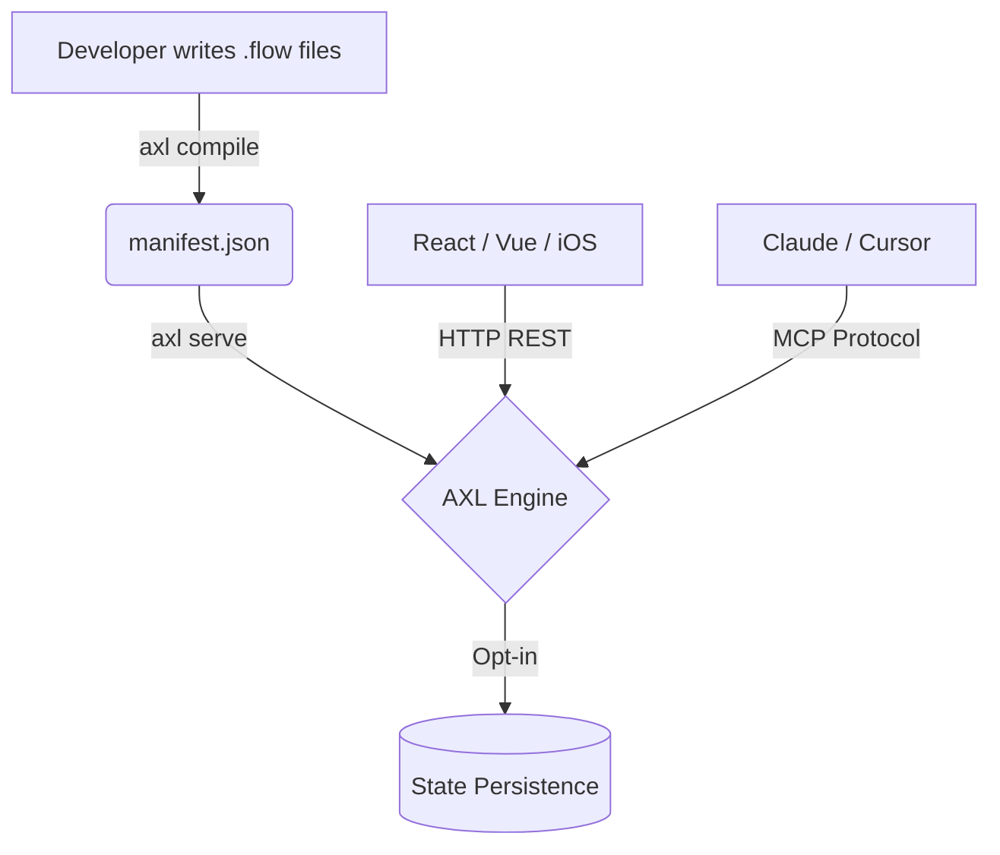

<div align="center">
  <h1>AXL</h1>
  <p><strong>AXL compiles a .flow spec into a permission-aware MCP server (and optionally a REST API) that proxies to a real backend.</strong></p>

  <p>
    <a href="#quick-start">Quick Start</a> •
    <a href="docs/installation.md">Installation</a> •
    <a href="#why-axl">Why AXL?</a> •
    <a href="examples/hotel-booking">Examples</a>
  </p>
</div>

---

## ⚡ What is AXL?

AXL is a strongly-typed, compile-to-engine framework for building the backbone of your application. Instead of writing spaghetti state machines in Node.js, you define your business logic, data models, workflows, and permissions in declarative `.flow` files. 

The AXL Compiler translates your declarative flows into a heavily optimized manifest, which the AXL Engine then executes with built-in state persistence, rate-limiting, and AI-ready transports (MCP & REST).

> **Ship complex workflows with OTP confirmation gates and role-based permissions in minutes, not months.**

---

## 🚀 Why AXL Exists

Modern applications demand robust backends. We frequently build the same features over and over again:
- Validating API inputs
- Enforcing rate limits and idempotency
- Wiring up two-factor authentication (OTP) gates for sensitive actions
- Pausing, resuming, and polling complex multi-step workflows
- Binding variables between workflow steps

AXL eliminates this boilerplate. By abstracting the transport and execution environment away from your logic, AXL guarantees that your workflows execute exactly as defined—securely and resiliently.

### Built for the AI Era
AXL natively serves your endpoints simultaneously as standard **REST APIs** (for your frontend) and as an **MCP (Model Context Protocol)** endpoint, enabling AI coding agents (like Claude or Cursor) to securely consume and orchestrate your backend logic instantly.

---

## ✨ Key Features

- 🏗 **Declarative Flow Syntax**: Build Entities, Actions, and Workflows in simple `.flow` syntax.
- 🛡 **Compile-time Safety**: Strong static validation ensures your data bindings and dependencies are correct before you ever hit runtime.
- 🚦 **Built-in Resilience**: Idempotency keys, rate-limiting, and stateful persistence out of the box.
- 🔐 **First-Class Auth & Permissions**: PUBLIC vs AUTH routing, implicit session handling, and native Two-Phase Commit OTP gates.
- 🌐 **Multi-Transport Support**: Spin up REST APIs and MCP Endpoints simultaneously from the same source of truth.

---

## 🏗 Architecture

<div align="center">
</div>



---

## ⏱ Quick Start

Get a fully functioning AXL server running in under 5 minutes.

### 1. Install AXL Globally
```bash
npm install -g @axl/cli
```

### 2. Initialize a Project
```bash
mkdir my-app && cd my-app
axl init -y
```

### 3. Compile your Flows
```bash
axl compile
```

### 4. Serve the Engine
Boot the engine with both REST and MCP endpoints active:
```bash
axl serve --both
```

You're live!
- Health: `http://localhost:3960/health`
- REST API: `http://localhost:3960/actions/:name`
- MCP Endpoint: `http://localhost:3960/mcp`

[Read the full Quick Start Guide →](docs/quickstart.md)

---

## 📚 Documentation

- [**Installation Guide**](docs/installation.md) - Node.js, npm/pnpm/bun, VS Code Extension.
- [**Quick Start Guide**](docs/quickstart.md) - Zero to Hero in 5 minutes.
- [**AGENT.md**](AGENT.md) - Guidelines for AI coding agents.

## 🏨 Examples

- [**Hotel Booking Engine**](examples/hotel-booking) - A complete reference implementation showcasing auth, workflows, OTP gates, and data binding.

---

## 🤝 Community & Contributing

We welcome contributions! Please see our guidelines to get started.

- [Contributing Guide](CONTRIBUTING.md)
- [Code of Conduct](CODE_OF_CONDUCT.md)
- [Security Policy](SECURITY.md)
- [Changelog](CHANGELOG.md)

---

## 📄 License

AXL is open source software licensed as [MIT](LICENSE).
